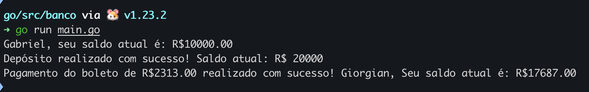

# 🏦 Banco Gopher 

Este projeto foi desenvolvido como parte do curso **"Go: Orientação a Objetos"** da Alura, ministrado por **Guilherme Lima**. O objetivo é consolidar conceitos de orientação a objetos utilizando a linguagem Go, aplicando esses conceitos em um sistema bancário simulado.

## 📋 Funcionalidades

- **Criação de Contas Correntes**
- **Saque e Depósito**
- **Transferências entre Contas**
- **Validação de Saldo**

## 🚀 Como Executar

### 1. Clonar o repositório

```
git clone https://github.com/kamillyceppas/banco-gopher.git
cd banco-gopher
```

### 2. Executar a aplicação
```
go run main.go
```
## 📸 Visualização do Terminal

### Exemplo:



## 🛠️ Tecnologias Utilizadas

- **Go**: Linguagem de programação principal.

## 🧠 Conceitos Aplicados

- **Structs** para modelagem de dados.
- **Ponteiros** para manipulação de referências.
- **Métodos** associados às structs para operações bancárias.

## Contato 📩

Se você tiver alguma dúvida ou sugestão, entre em contato comigo:

- **Nome:** Kamilly Ceppas 
- **GitHub:** [@kamillyceppas](https://github.com/kamillyceppas)
- **LinkedIn:** [Kamilly Ceppas](https://www.linkedin.com/in/kamillyceppas/)


